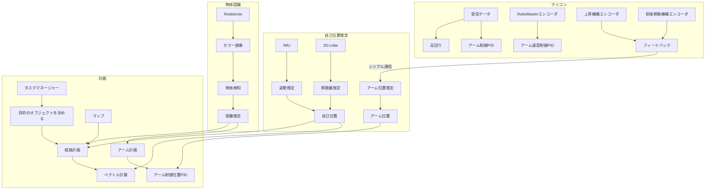

# Accurate

```mermaid
flowchart TD;
subgraph 自己位置推定
IMU --> 姿勢推定;
2D-Lidar --> 移動量推定;
姿勢推定 --> 自己位置;
移動量推定 --> 自己位置;
アーム位置推定　--> アーム位置
end

subgraph 物体認識
Realsense --> カラー画像;
カラー画像 --> 物体検知;
物体検知 --> 距離推定;
end

subgraph 計画
タスクマネージャー --> 目的のオブジェクトを決める;
マップ --> 経路計画
目的のオブジェクトを決める --> 経路計画;
自己位置 --> 経路計画;
距離推定 --> 経路計画;
距離推定 --> アーム計画;
経路計画 --> ベクトル計算;
アーム計画 --> アーム制御位置PID;
アーム位置 --> アーム制御位置PID;
自己位置 --> ベクトル計算;
end

subgraph マイコン
受信データ --> 足回り;
受信データ --> アーム制御PID;
RoboMasterエンコーダ --> アーム速度制御PID;
上昇機構エンコーダ --> フィードバック
前後移動機構エンコーダ -->　フィードバック
フィードバック -->|シリアル通信|アーム位置推定;
end
```
